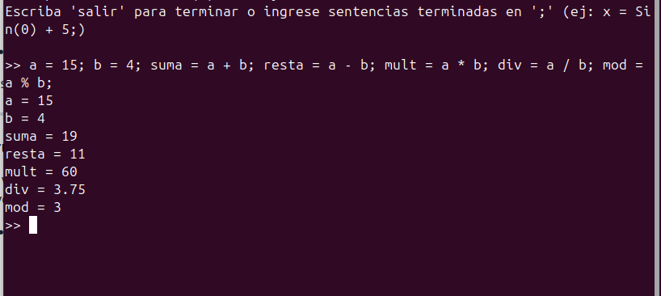
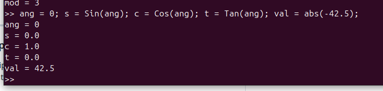
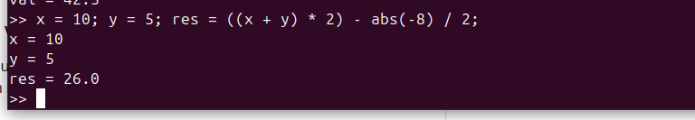
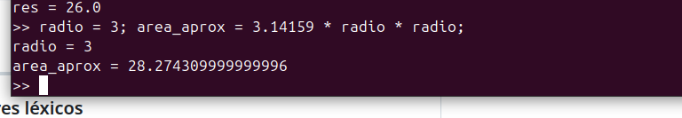
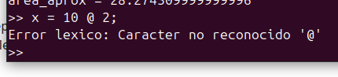
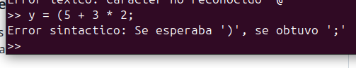
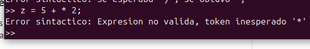
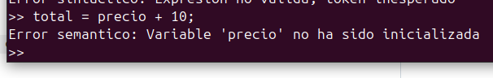
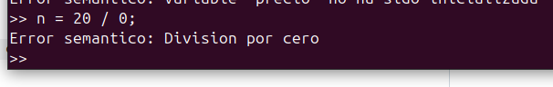
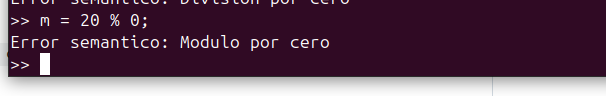

# Taller: Diseño e Implementación de una Gramática LL(1)

**Integrantes:** Arcos, Beltrán, Guitierrez y Lagos

---

## Qué se hizo

En este taller implemento una Gramática LL(1) para un lenguaje de programación. El lenguaje soporta operaciones binarias básicas ($+$, $-$, $*$, $/$, $\text{mod}$), funciones matemáticas ($\text{abs}$, $\text{Sin}$, $\text{Cos}$, $\text{Tan}$) y asignación de variables en memoria mediante una tabla de símbolos.

El sistema garantiza de manera estricta las tres fases fundamentales del procesamiento de lenguajes:

1. **Fase Léxica (Lexer):** Escanea el flujo de caracteres para producir tokens clasificados: identificadores ($\textbf{id}$), literales numéricos enteros y decimales ($\textbf{num}$), operadores aritméticos, asignación ($=$), agrupadores ($($ y $)$), delimitadores de instrucción ($;$) y palabras reservadas para las funciones ($\text{abs}$, $\text{Sin}$, $\text{Cos}$, $\text{Tan}$). Ignora espacios en blanco y comentarios con `#`, y reporta de inmediato cualquier carácter no admitido.
2. **Fase Sintáctica (Parser LL(1)):** Implementé un analizador descendente predictivo recursivo. Para admitir tanto asignaciones de variables ($\textbf{id} = E$) como expresiones sin ambigüedad en el token $\textbf{id}$, apliqué factorización por la izquierda. Esto asegura que la selección de cada producción sea determinista con exactamente 1 símbolo de preanálisis (*lookahead*).
3. **Fase Semántica (Evaluador y Tabla de Símbolos):** Valida la existencia y alcance de las variables antes de su uso (evitando variables no inicializadas), detecta en tiempo de ejecución divisiones y módulos por cero, y sintetiza el cálculo numérico respetando la precedencia formal y asociatividad de las operaciones.

---

### Especificación Formal de la Gramática LL(1)

#### Símbolos Terminales ($\Sigma$)
$$
\Sigma = \{ \textbf{id}, \textbf{num}, =, +, -, *, /, \text{mod}, (, ), \text{abs}, \text{Sin}, \text{Cos}, \text{Tan}, ;, \text{EOF} \}
$$

#### Símbolos No Terminales ($V_N$)
$$
V_N = \{ P, L, S, S', E_{noid}, E, E', T, T', F, F_{noid}, Fn \}
$$

**Símbolo inicial:** $P$

#### Producciones de la Gramática
1. $P \to L$
2. $L \to S \; ; \; L$
3. $L \to \epsilon$
4. $S \to \textbf{id} \; S'$
5. $S \to E_{noid}$
6. $S' \to = \; E$
7. $S' \to T' \; E'$
8. $E_{noid} \to F_{noid} \; T' \; E'$
9. $E \to T \; E'$
10. $E' \to + \; T \; E'$
11. $E' \to - \; T \; E'$
12. $E' \to \epsilon$
13. $T \to F \; T'$
14. $T' \to * \; F \; T'$
15. $T' \to / \; F \; T'$
16. $T' \to \text{mod} \; F \; T'$
17. $T' \to \epsilon$
18. $F \to \textbf{id}$
19. $F \to F_{noid}$
20. $F_{noid} \to \textbf{num}$
21. $F_{noid} \to - \; F$
22. $F_{noid} \to ( \; E \; )$
23. $F_{noid} \to Fn \; ( \; E \; )$
24. $Fn \to \textbf{abs}$
25. $Fn \to \textbf{Sin}$
26. $Fn \to \textbf{Cos}$
27. $Fn \to \textbf{Tan}$

---

### Conjuntos Matemáticos: Primeros ($FIRST$) y Siguientes ($FOLLOW$)

El cálculo matemático riguroso de los conjuntos de primeros y siguientes para cada símbolo no terminal se expresa a continuación:

$$
\begin{aligned}
FIRST(P) &= \{ (, -, \text{Cos}, \text{Sin}, \text{Tan}, \text{abs}, \textbf{id}, \textbf{num}, \epsilon \} \\
FOLLOW(P) &= \{ \text{EOF} \} \\
FIRST(L) &= \{ (, -, \text{Cos}, \text{Sin}, \text{Tan}, \text{abs}, \textbf{id}, \textbf{num}, \epsilon \} \\
FOLLOW(L) &= \{ \text{EOF} \} \\
FIRST(S) &= \{ (, -, \text{Cos}, \text{Sin}, \text{Tan}, \text{abs}, \textbf{id}, \textbf{num} \} \\
FOLLOW(S) &= \{ ; \} \\
FIRST(S') &= \{ \text{mod}, *, +, -, /, =, \epsilon \} \\
FOLLOW(S') &= \{ ; \} \\
FIRST(E_{noid}) &= \{ (, -, \text{Cos}, \text{Sin}, \text{Tan}, \text{abs}, \textbf{num} \} \\
FOLLOW(E_{noid}) &= \{ ; \} \\
FIRST(E) &= \{ (, -, \text{Cos}, \text{Sin}, \text{Tan}, \text{abs}, \textbf{id}, \textbf{num} \} \\
FOLLOW(E) &= \{ ), ; \} \\
FIRST(E') &= \{ +, -, \epsilon \} \\
FOLLOW(E') &= \{ ), ; \} \\
FIRST(T) &= \{ (, -, \text{Cos}, \text{Sin}, \text{Tan}, \text{abs}, \textbf{id}, \textbf{num} \} \\
FOLLOW(T) &= \{ ), +, -, ; \} \\
FIRST(T') &= \{ \text{mod}, *, /, \epsilon \} \\
FOLLOW(T') &= \{ ), +, -, ; \} \\
FIRST(F) &= \{ (, -, \text{Cos}, \text{Sin}, \text{Tan}, \text{abs}, \textbf{id}, \textbf{num} \} \\
FOLLOW(F) &= \{ \text{mod}, ), *, +, -, /, ; \} \\
FIRST(F_{noid}) &= \{ (, -, \text{Cos}, \text{Sin}, \text{Tan}, \text{abs}, \textbf{num} \} \\
FOLLOW(F_{noid}) &= \{ \text{mod}, ), *, +, -, /, ; \} \\
FIRST(Fn) &= \{ \text{Cos}, \text{Sin}, \text{Tan}, \text{abs} \} \\
FOLLOW(Fn) &= \{ ( \}
\end{aligned}
$$

#### Tabla Resumen de Primeros y Siguientes

| No Terminal ($A$) | $FIRST(A)$ | $FOLLOW(A)$ |
| :--- | :--- | :--- |
| **$P$** | `(`, `-`, `Cos`, `Sin`, `Tan`, `abs`, `id`, `num`, `ε` | `EOF` |
| **$L$** | `(`, `-`, `Cos`, `Sin`, `Tan`, `abs`, `id`, `num`, `ε` | `EOF` |
| **$S$** | `(`, `-`, `Cos`, `Sin`, `Tan`, `abs`, `id`, `num` | `;` |
| **$S'$** | `%`, `*`, `+`, `-`, `/`, `=`, `ε` | `;` |
| **$E_{noid}$** | `(`, `-`, `Cos`, `Sin`, `Tan`, `abs`, `num` | `;` |
| **$E$** | `(`, `-`, `Cos`, `Sin`, `Tan`, `abs`, `id`, `num` | `)`, `;` |
| **$E'$** | `+`, `-`, `ε` | `)`, `;` |
| **$T$** | `(`, `-`, `Cos`, `Sin`, `Tan`, `abs`, `id`, `num` | `)`, `+`, `-`, `;` |
| **$T'$** | `%`, `*`, `/`, `ε` | `)`, `+`, `-`, `;` |
| **$F$** | `(`, `-`, `Cos`, `Sin`, `Tan`, `abs`, `id`, `num` | `%`, `)`, `*`, `+`, `-`, `/`, `;` |
| **$F_{noid}$** | `(`, `-`, `Cos`, `Sin`, `Tan`, `abs`, `num` | `%`, `)`, `*`, `+`, `-`, `/`, `;` |
| **$Fn$** | `Cos`, `Sin`, `Tan`, `abs` | `(` |

---

### Conjuntos de Predicción / Selección ($PRED$)

El conjunto de predicción para cada regla $A \to \alpha$ se define formalmente como:

$$
PRED(A \to \alpha) = \begin{cases} 
FIRST(\alpha) & \text{si } \epsilon \notin FIRST(\alpha) \\ 
(FIRST(\alpha) \setminus \{ \epsilon \}) \cup FOLLOW(A) & \text{si } \epsilon \in FIRST(\alpha) 
\end{cases}
$$

A continuación se detalla la definición matemática de cada regla de producción:

$$
\begin{aligned}
PRED(P \to L) &= \{ \text{EOF}, (, -, \text{Cos}, \text{Sin}, \text{Tan}, \text{abs}, \textbf{id}, \textbf{num} \} \\
PRED(L \to S \; ; \; L) &= \{ (, -, \text{Cos}, \text{Sin}, \text{Tan}, \text{abs}, \textbf{id}, \textbf{num} \} \\
PRED(L \to \epsilon) &= \{ \text{EOF} \} \\
PRED(S \to \textbf{id} \; S') &= \{ \textbf{id} \} \\
PRED(S \to E_{noid}) &= \{ (, -, \text{Cos}, \text{Sin}, \text{Tan}, \text{abs}, \textbf{num} \} \\
PRED(S' \to = \; E) &= \{ = \} \\
PRED(S' \to T' \; E') &= \{ \text{mod}, *, +, -, /, ; \} \\
PRED(E_{noid} \to F_{noid} \; T' \; E') &= \{ (, -, \text{Cos}, \text{Sin}, \text{Tan}, \text{abs}, \textbf{num} \} \\
PRED(E \to T \; E') &= \{ (, -, \text{Cos}, \text{Sin}, \text{Tan}, \text{abs}, \textbf{id}, \textbf{num} \} \\
PRED(E' \to + \; T \; E') &= \{ + \} \\
PRED(E' \to - \; T \; E') &= \{ - \} \\
PRED(E' \to \epsilon) &= \{ ), ; \} \\
PRED(T \to F \; T') &= \{ (, -, \text{Cos}, \text{Sin}, \text{Tan}, \text{abs}, \textbf{id}, \textbf{num} \} \\
PRED(T' \to * \; F \; T') &= \{ * \} \\
PRED(T' \to / \; F \; T') &= \{ / \} \\
PRED(T' \to \text{mod} \; F \; T') &= \{ \text{mod} \} \\
PRED(T' \to \epsilon) &= \{ ), +, -, ; \} \\
PRED(F \to \textbf{id}) &= \{ \textbf{id} \} \\
PRED(F \to F_{noid}) &= \{ (, -, \text{Cos}, \text{Sin}, \text{Tan}, \text{abs}, \textbf{num} \} \\
PRED(F_{noid} \to \textbf{num}) &= \{ \textbf{num} \} \\
PRED(F_{noid} \to - \; F) &= \{ - \} \\
PRED(F_{noid} \to ( \; E \; )) &= \{ ( \} \\
PRED(F_{noid} \to Fn \; ( \; E \; )) &= \{ \text{Cos}, \text{Sin}, \text{Tan}, \text{abs} \} \\
PRED(Fn \to \textbf{abs}) &= \{ \textbf{abs} \} \\
PRED(Fn \to \textbf{Sin}) &= \{ \textbf{Sin} \} \\
PRED(Fn \to \textbf{Cos}) &= \{ \textbf{Cos} \} \\
PRED(Fn \to \textbf{Tan}) &= \{ \textbf{Tan} \}
\end{aligned}
$$

#### Tabla Resumen de Conjuntos de Predicción

| Regla | Producción | $PRED$ (Tokens de Selección) |
| :---: | :--- | :--- |
| **1** | $P \to L$ | `EOF`, `(`, `-`, `Cos`, `Sin`, `Tan`, `abs`, `id`, `num` |
| **2** | $L \to S \; ; \; L$ | `(`, `-`, `Cos`, `Sin`, `Tan`, `abs`, `id`, `num` |
| **3** | $L \to \epsilon$ | `EOF` |
| **4** | $S \to \textbf{id} \; S'$ | `id` |
| **5** | $S \to E_{noid}$ | `(`, `-`, `Cos`, `Sin`, `Tan`, `abs`, `num` |
| **6** | $S' \to = \; E$ | `=` |
| **7** | $S' \to T' \; E'$ | `%`, `*`, `+`, `-`, `/`, `;` |
| **8** | $E_{noid} \to F_{noid} \; T' \; E'$ | `(`, `-`, `Cos`, `Sin`, `Tan`, `abs`, `num` |
| **9** | $E \to T \; E'$ | `(`, `-`, `Cos`, `Sin`, `Tan`, `abs`, `id`, `num` |
| **10** | $E' \to + \; T \; E'$ | `+` |
| **11** | $E' \to - \; T \; E'$ | `-` |
| **12** | $E' \to \epsilon$ | `)`, `;` |
| **13** | $T \to F \; T'$ | `(`, `-`, `Cos`, `Sin`, `Tan`, `abs`, `id`, `num` |
| **14** | $T' \to * \; F \; T'$ | `*` |
| **15** | $T' \to / \; F \; T'$ | `/` |
| **16** | $T' \to \text{mod} \; F \; T'$ | `%` |
| **17** | $T' \to \epsilon$ | `)`, `+`, `-`, `;` |
| **18** | $F \to \textbf{id}$ | `id` |
| **19** | $F \to F_{noid}$ | `(`, `-`, `Cos`, `Sin`, `Tan`, `abs`, `num` |
| **20** | $F_{noid} \to \textbf{num}$ | `num` |
| **21** | $F_{noid} \to - \; F$ | `-` |
| **22** | $F_{noid} \to ( \; E \; )$ | `(` |
| **23** | $F_{noid} \to Fn \; ( \; E \; )$ | `Cos`, `Sin`, `Tan`, `abs` |
| **24** | $Fn \to \textbf{abs}$ | `abs` |
| **25** | $Fn \to \textbf{Sin}$ | `Sin` |
| **26** | $Fn \to \textbf{Cos}$ | `Cos` |
| **27** | $Fn \to \textbf{Tan}$ | `Tan` |

#### Verificación de la Condición LL(1)
Para cada no terminal con producciones alternativas $A \to \alpha_1 \mid \alpha_2 \mid \dots \mid \alpha_n$, se cumple rigurosamente que:

$$
PRED(A \to \alpha_i) \cap PRED(A \to \alpha_j) = \emptyset \quad \forall \; i \neq j
$$

Por lo tanto, la gramática es estrictamente determinista y pertenece a la clase **LL(1)**.

---

## Cómo se ejecuta

### Requisitos
- Linux (probado en Ubuntu 20.04 / 22.04 LTS).
- Python 3.8 o superior.
- No requiere dependencias externas ni librerías de terceros (utiliza únicamente la librería estándar de Python).

### Estructura del proyecto
```text
taller_gramatica_ll1/
├── interprete.py    # Analizador Léxico, Sintáctico LL(1) y Semántico
├── ejemplo.txt       # Script de demostración con operaciones y asignaciones
└── README.md         # Documentación académica del taller
```

### Instrucciones paso a paso en terminal

1. **Abrir la terminal e ingresar al directorio del taller:**
   ```bash
   cd ~/Documentos/taller_gramatica_ll1
   ```

2. **Verificar la versión instalada de Python:**
   ```bash
   python3 --version
   ```

3. **Ejecutar el script de prueba integrado:**
   Para ejecutar el archivo de ejemplo `ejemplo.txt` y observar la evaluación de las instrucciones junto a la tabla de símbolos final:
   ```bash
   python3 interprete.py ejemplo.txt
   ```

4. **Ejecutar la suite automatizada de pruebas:**
   Para comprobar todos los casos válidos y los escenarios de error controlado (léxico, sintáctico y semántico):
   ```bash
   python3 interprete.py --test
   ```

5. **Modo interactivo (REPL):**
   Si se desea ingresar instrucciones interactivamente línea por línea:
   ```bash
   python3 interprete.py
   ```
   *Ejemplo de uso en el prompt:*
   ```text
   >> x = 10;
   x = 10
   >> y = Sin(0) + 5;
   y = 5.0
   >> res = (x * 2) - y;
   res = 15.0
   >> salir
   ```

---

## Pruebas y Resultados

Para certificar el correcto funcionamiento de las fases léxica, sintáctica y semántica, diseñé un conjunto completo de pruebas unitarias y de integración.

### Prueba 1: Asignaciones de variables y aritmética básica (+, -, *, /, %)
Esta prueba comprueba la correcta tokenización de identificadores y números, el análisis sintáctico de operaciones binarias y la actualización en la tabla de símbolos.
- **Entrada:**
  ```text
  a = 15; b = 4; suma = a + b; resta = a - b; mult = a * b; div = a / b; mod = a % b;
  ```
- **Resultado:**
  Se asigna $a = 15$, $b = 4$, $\text{suma} = 19$, $\text{resta} = 11$, $\text{mult} = 60$, $\text{div} = 3.75$ y $\text{mod} = 3$.



---

### Prueba 2: Funciones matemáticas ($\text{abs}$, $\text{Sin}$, $\text{Cos}$, $\text{Tan}$)
Se verifica el reconocimiento de palabras reservadas, la resolución de argumentos entre paréntesis y la invocación de las funciones matemáticas estándar.
- **Entrada:**
  ```text
  ang = 0; s = Sin(ang); c = Cos(ang); t = Tan(ang); val = abs(-42.5);
  ```
- **Resultado:**
  $\text{ang} = 0$, $s = 0.0$, $c = 1.0$, $t = 0.0$ y $\text{val} = 42.5$.
  


---

### Prueba 3: Jerarquía de operadores y expresiones compuestas con paréntesis
Se evalúa la correcta precedencia gramatical (multiplicación, división y módulo preceden a la suma y resta), la asociatividad por izquierda y la anidación de paréntesis.
- **Entrada:**
  ```text
  x = 10; y = 5; res = ((x + y) * 2) - abs(-8) / 2;
  ```
- **Resultado:**
  El analizador evalúa primero $(x + y) = 15$, luego multiplica por $2$ ($30$), calcula $\text{abs}(-8) / 2 = 4.0$ y finalmente resta para obtener $\text{res} = 26.0$.




---

### Prueba 4: Reutilización acumulativa de variables en la tabla de símbolos
Demuestra que la memoria de variables persiste durante la ejecución del programa y que los valores previamente computados pueden ser utilizados en nuevas fórmulas.
- **Entrada:**
  ```text
  radio = 3; area_aprox = 3.14159 * radio * radio;
  ```



---

### Prueba 5: Detección y captura de errores léxicos
Se verifica que el analizador léxico identifique caracteres ajenos al alfabeto del lenguaje y reporte el error sin generar un fallo abrupto en el intérprete.
- **Entrada:**
  ```text
  x = 10 @ 2;
  ```
- **Resultado obtenido:**
  `Error lexico: Caracter no reconocido '@'`




---

### Prueba 6: Detección y captura de errores sintácticos
Se valida que el parser descendente reporte discrepancias con la gramática, tales como paréntesis sin cerrar o tokens inesperados que violen los conjuntos de selección.
- **Caso A (Paréntesis sin cerrar):**
  - **Entrada:** `y = (5 + 3 * 2;`
  - **Resultado:** `Error sintactico: Se esperaba ')', se obtuvo ';'`

 


- **Caso B (Operador sin operando):**
  - **Entrada:** `z = 5 + * 2;`
  - **Resultado:** `Error sintactico: Expresion no valida, token inesperado '*'`




---

### Prueba 7: Detección y captura de errores semánticos
Se asegura la consistencia de las reglas semánticas en tiempo de ejecución: uso de variables declaradas y prohibición de operaciones aritméticas matemáticamente indefinidas.
- **Caso A (Variable no inicializada):**
  - **Entrada:** `total = precio + 10;`
  - **Resultado:** `Error semantico: Variable 'precio' no ha sido inicializada`
   



- **Caso B (División por cero):**
  - **Entrada:** `n = 20 / 0;`
  - **Resultado:** `Error semantico: Division por cero`
 


   
- **Caso C (Módulo por cero):**
  - **Entrada:** `m = 20 % 0;`
  - **Resultado:** `Error semantico: Modulo por cero`



